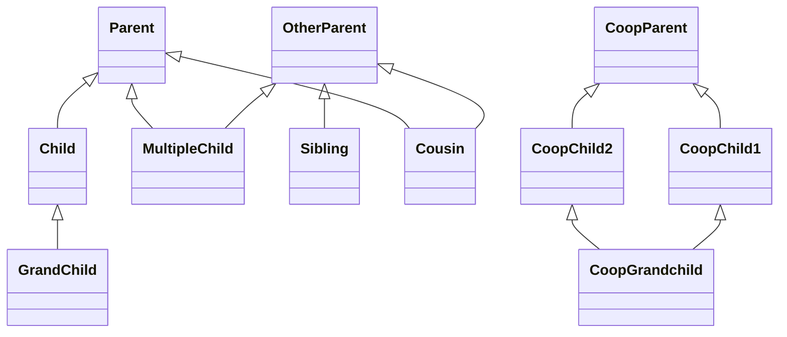
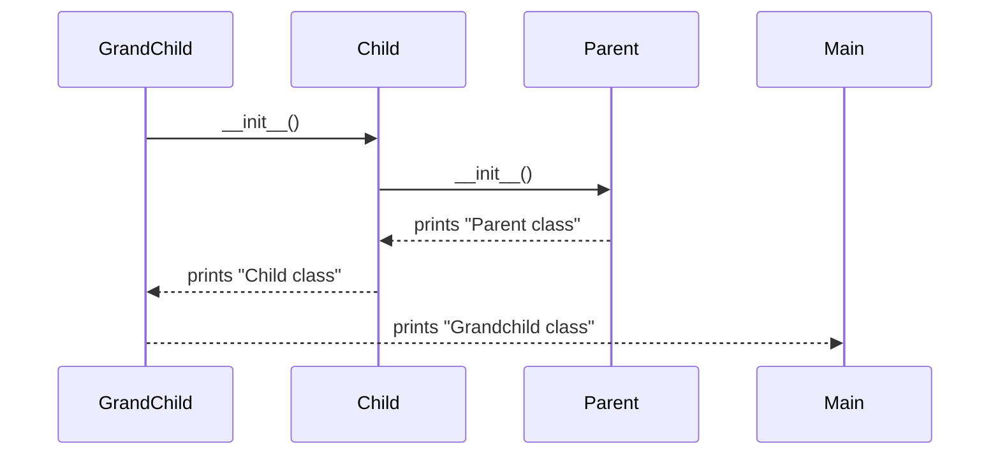
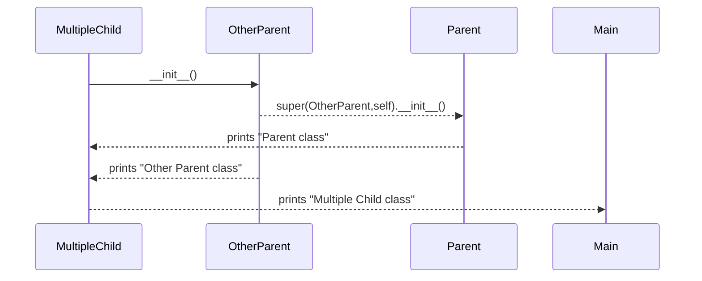
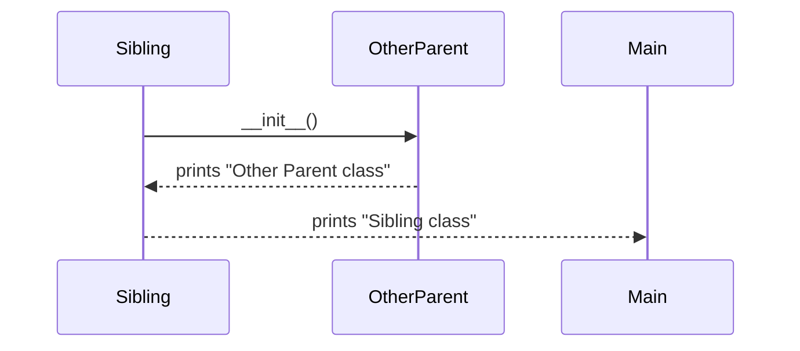
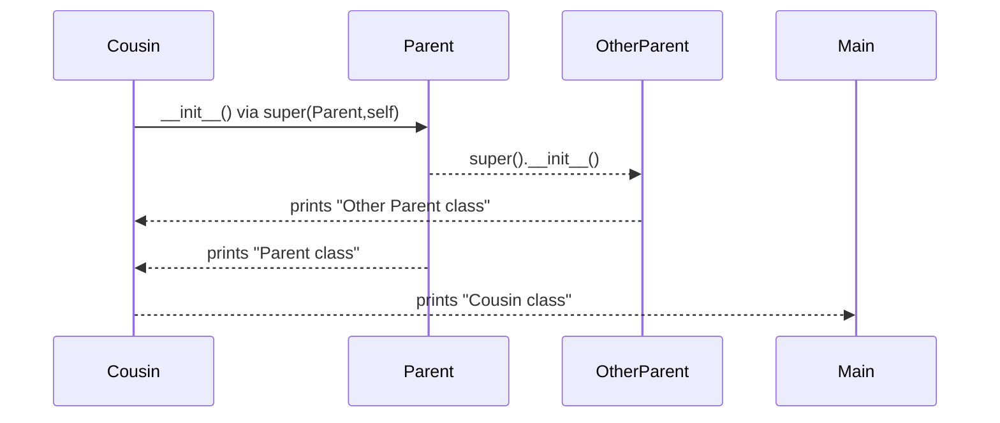
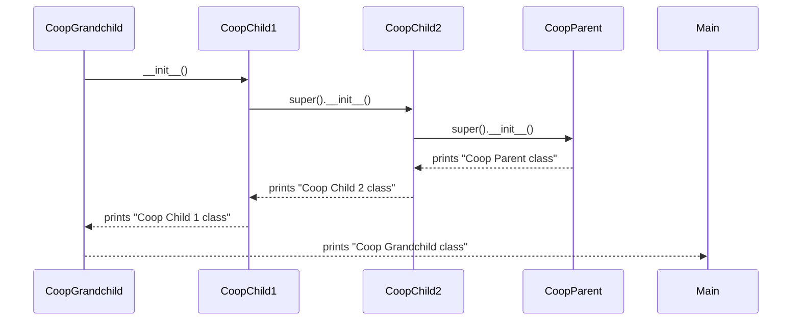

# Python Inheritance & MRO Insights

This document analyzes a hierarchy of Python classes demonstrating **single inheritance, multiple inheritance, and cooperative inheritance**.  

The focus is on:
- Class hierarchy (static view)  
- Constructor call order via `super()` (dynamic view, following Python MRO)

---

## 📌 Class Hierarchy

---

## 📌 Constructor Call Order (via `super()`)

### 1. `GrandChild()`

**Order**: `Parent → Child → GrandChild`

---

### 2. `MultipleChild()`

MRO = `[MultipleChild, OtherParent, Parent, object]`

**Order**: `OtherParent → Parent → MultipleChild`  
(due to explicit `super(OtherParent, self)` usage)

---

### 3. `Sibling()`

**Order**: `OtherParent → Sibling`

---

### 4. `Cousin()`

MRO = `[Cousin, OtherParent, Parent, object]`

**Order**: `OtherParent → Parent → Cousin`

---

### 5. `CoopGrandchild()`

MRO = `[CoopGrandchild, CoopChild1, CoopChild2, CoopParent, object]`

**Order**: `CoopParent → CoopChild2 → CoopChild1 → CoopGrandchild`  

---

## 🔑 Key Insights
1. **Single inheritance** follows a straight chain (`GrandChild → Child → Parent`).  
2. **Multiple inheritance** depends on MRO and explicit `super()` usage.  
3. **Cooperative inheritance** with `super()` ensures that each parent constructor runs **exactly once** in a diamond hierarchy.  
4. Python MRO resolves ambiguity by linearizing the class hierarchy.  

---

## 📊 MRO & Constructor Call Summary

| Class            | MRO Order                                               | Constructor Call Sequence                        |
|------------------|--------------------------------------------------------|-------------------------------------------------|
| `GrandChild`     | `[GrandChild, Child, Parent, object]`                  | `Parent → Child → GrandChild`                   |
| `MultipleChild`  | `[MultipleChild, OtherParent, Parent, object]`         | `OtherParent → Parent → MultipleChild`          |
| `Sibling`        | `[Sibling, OtherParent, object]`                       | `OtherParent → Sibling`                         |
| `Cousin`         | `[Cousin, OtherParent, Parent, object]`                | `OtherParent → Parent → Cousin`                 |
| `CoopGrandchild` | `[CoopGrandchild, CoopChild1, CoopChild2, CoopParent, object]` | `CoopParent → CoopChild2 → CoopChild1 → CoopGrandchild` |

---
